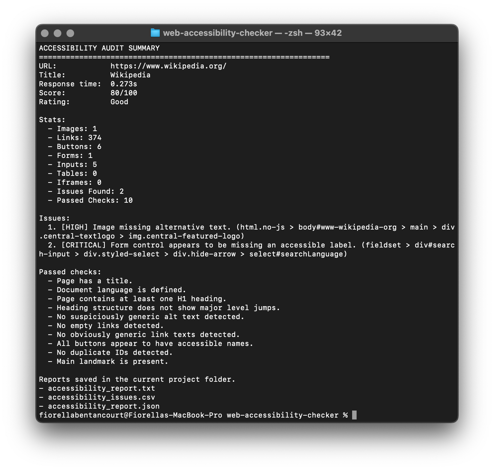

<div align="center">

# 🌐 Web Accessibility Checker


**A Python-based web accessibility auditing tool that analyzes web pages, detects common accessibility issues, and generates structured reports.**  
**Una herramienta de auditoría de accesibilidad web desarrollada en Python que analiza páginas, detecta problemas comunes de accesibilidad y genera reportes estructurados.**

</div>

---

## 📸 Demo

<p align="center">
  
</p>

---
---

## English Version

### 📌 Overview

This project is a command-line application built in Python that audits web pages for basic accessibility issues. It uses web scraping and HTML parsing techniques to identify common problems that can impact users with disabilities.

The goal of this project is to demonstrate how accessibility can be approached programmatically while applying clean architecture, modular design, and real-world problem-solving.

---

### ⚙️ Features

* Analyze any webpage via URL
* Detect missing `alt` text in images
* Identify empty or non-accessible links
* Check for missing `<h1>` headings
* Validate presence of `lang` attribute in `<html>`
* Evaluate buttons and form accessibility
* Generate structured reports
* Accessibility scoring system

---

### 🧠 Technologies Used

* Python 3
* Requests
* BeautifulSoup
* File handling (TXT reports)
* Modular architecture

---

### 🏗️ Project Structure

```
web-accessibility-checker/
│── main.py
│── README.md
│── requirements.txt
└── checker/
    ├── __init__.py
    ├── fetcher.py
    ├── parser.py
    ├── reporter.py
    ├── rules.py
    ├── models.py
    └── utils.py
```

---

### ▶️ How to Run

```bash
pip install -r requirements.txt
python3 main.py
```

Then enter a URL to analyze.

---

### 📊 Example Output

```
Accessibility Audit Summary
---------------------------
URL: https://example.com
Score: 82/100

Issues found:
- Missing alt text in images
- Empty links detected

Passed checks:
- Page has a title
- HTML lang attribute present
```

---

### 🎯 Purpose

This project was created to:

* Explore accessibility in web development
* Practice web scraping and HTML parsing
* Build a structured and modular Python application
* Develop solutions that have real social impact

---

### 🚀 Future Improvements

* Crawl multiple pages within a website
* Export reports in CSV and JSON formats
* Add more WCAG-based validations
* Build a web interface (UI)
* Integrate NLP for content simplification

---
## ✨ Key Highlights

- Real-world accessibility auditing tool
- Rule-based validation inspired by WCAG principles
- Multi-format reporting (TXT, CSV, JSON)
- Modular and scalable Python architecture
- Designed with accessibility and inclusion in mind

---
## 🧪 Example Use Case

This tool can be used by developers, designers, or QA teams to quickly evaluate the accessibility of a webpage and identify common issues that may impact users with disabilities.

It is especially useful in educational, content-driven, or accessibility-focused environments.

---
## ⚠️ Limitations

- This tool analyzes static HTML and does not execute JavaScript
- It provides heuristic checks and does not fully implement WCAG standards
- Some accessibility issues may require manual evaluation

---
## Versión en Español

### 📌 Descripción

Este proyecto es una aplicación de línea de comandos desarrollada en Python que analiza páginas web en busca de problemas básicos de accesibilidad.

Utiliza técnicas de web scraping y análisis de HTML para detectar errores comunes que pueden afectar la experiencia de usuarios con discapacidades.

---

### ⚙️ Funcionalidades

* Analiza cualquier página web a partir de una URL
* Detecta imágenes sin atributo `alt`
* Identifica enlaces vacíos o poco accesibles
* Verifica la presencia de `<h1>`
* Revisa si el documento tiene atributo `lang`
* Evalúa accesibilidad en botones y formularios
* Genera reportes estructurados
* Sistema de puntuación de accesibilidad

---

### 🧠 Tecnologías

* Python 3
* Requests
* BeautifulSoup
* Manejo de archivos
* Arquitectura modular

---

### ▶️ Cómo ejecutarlo

```bash
pip install -r requirements.txt
python3 main.py
```

Luego ingresa una URL para analizar.

---

### 🎯 Objetivo

Este proyecto fue creado para:

* Explorar la accesibilidad web desde Python
* Aplicar buenas prácticas de desarrollo
* Construir una solución con impacto real
* Desarrollar habilidades técnicas en scraping y parsing

---

### 🚀 Mejoras futuras

* Analizar múltiples páginas (crawler)
* Exportar reportes en CSV y JSON
* Incluir más validaciones WCAG
* Crear interfaz gráfica
* Integrar inteligencia artificial para simplificación de contenido

---

### 👩‍💻 Author

Fiorella Bentancourt  
[GitHub Profile](https://github.com/bentancourtfiorellanahir-bot)
